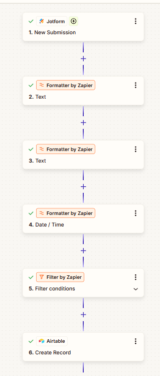
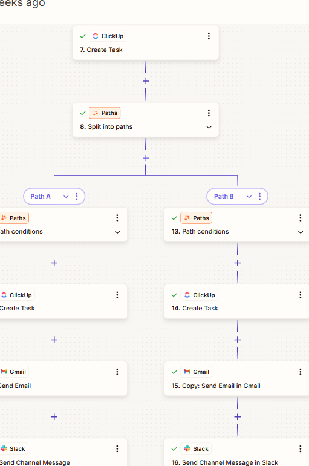

# 🚀 Client Onboarding Automation System

An automated workflow designed to streamline client onboarding by capturing, processing, and routing data across multiple tools. This system reduces manual work, improves response time, and ensures efficient team collaboration.

---

## 📌 Overview

This project automates the entire onboarding process—from collecting client information to creating tasks and notifying teams—using an integrated workflow built with Zapier.

---

## ⚙️ Workflow Breakdown

### 1. Form Submission (Trigger)
- Captures client details via Jotform
- Initiates the automation workflow

### 2. Data Processing
- Cleans and formats input data using formatter steps
- Standardizes text and date fields for consistency

### 3. Lead Filtering
- Applies conditions to process only qualified or relevant submissions
- Prevents unnecessary workflow execution

### 4. Data Storage
- Stores structured client data in Airtable
- Maintains a centralized database for tracking

### 5. Task Creation
- Automatically creates tasks in ClickUp
- Includes client details for immediate team action

### 6. Conditional Routing (Paths)
- Splits workflow based on predefined conditions
- Enables customized onboarding flows for different client types

### 7. Notifications & Communication
- Sends emails via Gmail
- Notifies team via Slack
- Ensures real-time updates and collaboration

---

## 🧠 Tech Stack

- Zapier (workflow automation)
- Jotform (data collection)
- Airtable (database)
- ClickUp (task management)
- Gmail (email automation)
- Slack (team communication)

---

## 💡 Use Cases

- Client onboarding automation  
- Lead management systems  
- Workflow automation for agencies  
- Business process optimization  

---

## 🎯 Key Benefits

- Reduces manual data handling  
- Improves response time  
- Ensures structured workflow execution  
- Enhances team collaboration  

---

## 📸 Workflow Preview

## 📸 Workflow Preview

### 🔹 Main Workflow

### 🔹 Step-by-Step Flow

---

## 🚀 Future Improvements

- Add AI-based lead scoring  
- Integrate intelligent response system  
- Migrate to n8n for advanced control and scalability  

---

## 📌 Conclusion

This project demonstrates the design of a scalable automation system that can be applied to real-world business operations, helping teams manage clients more efficiently and consistently.
